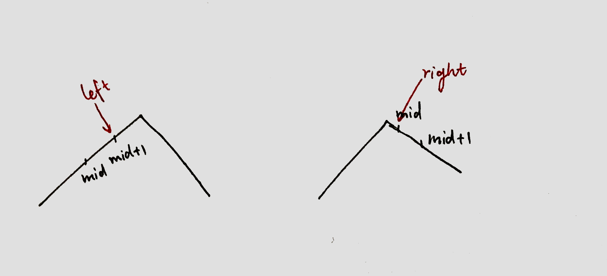

本文档用来记录 **leetcode** 前200题目中的easy与medium题目的思路。


- [1.两数之和](#1两数之和)
- [2  两数相加](#2--两数相加)
- [3. 无重复字符的最长子串](#3-无重复字符的最长子串)
- [5. 最长回文子串](#5-最长回文子串)
- [7. 整数反转](#7-整数反转)
- [9. 回文数](#9-回文数)
- [11. 盛最多水的容器](#11-盛最多水的容器)
- [13. 罗马数字转整数](#13-罗马数字转整数)
- [14. 最长公共前缀](#14-最长公共前缀)
- [15. 三数之和](#15-三数之和)
- [17. 电话号码的字母组合](#17-电话号码的字母组合)
- [19. 删除链表的倒数第 N 个结点](#19-删除链表的倒数第-n-个结点)
- [20. 有效的括号](#20-有效的括号)
- [21. 合并两个有序链表](#21-合并两个有序链表)
- [22. 括号生成](#22-括号生成)
- [26. 删除有序数组中的重复项](#26-删除有序数组中的重复项)
- [27. 移除元素](#27-移除元素)
- [28. 实现 strStr()](#28-实现-strstr)
- [33. 搜索旋转排序数组](#33-搜索旋转排序数组)
- [34.在排序数组中查找元素的第一个和最后一个位置](#34在排序数组中查找元素的第一个和最后一个位置)
- [35. 搜索插入位置](#35-搜索插入位置)
- [36. 有效的数独](#36-有效的数独)
- [38. 外观数列](#38-外观数列)
- [46. 全排列](#46-全排列)
- [48.旋转图像](#48旋转图像)
- [49. 字母异位词分组](#49-字母异位词分组)
- [50. Pow(x, n)](#50-powx-n)
- [53. 最大子序和](#53-最大子序和)
- [54. 螺旋矩阵](#54-螺旋矩阵)
- [55. 跳跃游戏](#55-跳跃游戏)
- [56. 合并区间](#56-合并区间)
- [58. 最后一个单词的长度](#58-最后一个单词的长度)
- [62. 不同路径](#62-不同路径)
- [64. 最小路径和](#64-最小路径和)
- [66. 加一](#66-加一)
- [67. 二进制求和](#67-二进制求和)
- [69. x 的平方根](#69-x-的平方根)
- [70. 爬楼梯](#70-爬楼梯)
- [73. 矩阵置零](#73-矩阵置零)
- [78. 子集](#78-子集)
- [79. 单词搜索](#79-单词搜索)
- [258. 各位相加](#258-各位相加)
- [121 买卖股票的最佳时机](#121-买卖股票的最佳时机)
- [1221. 分割平衡字符串](#1221-分割平衡字符串)
- [1725. 可以形成最大正方形的矩形数目](#1725-可以形成最大正方形的矩形数目)
- [1710. 卡车上的最大单元数](#1710-卡车上的最大单元数)
- [1716.计算力扣银行的钱](#1716计算力扣银行的钱)
- [944. 删列造序](#944-删列造序)
- [1518. 换酒问题](#1518-换酒问题)
- [1046. 最后一块石头的重量](#1046-最后一块石头的重量)
- [860. 柠檬水找零](#860-柠檬水找零)
- [455 分发饼干](#455-分发饼干)
- [392. 判断子序列](#392-判断子序列)
- [](#)
- [122. 买卖股票的最佳时机 II](#122-买卖股票的最佳时机-ii)
- [118. 杨辉三角](#118-杨辉三角)
- [167. 两数之和 II - 输入有序数组](#167-两数之和-ii---输入有序数组)
- [169. 多数元素](#169-多数元素)
- [141. 环形链表](#141-环形链表)
- [125. 验证回文串](#125-验证回文串)
- [83. 删除排序链表中的重复元素](#83-删除排序链表中的重复元素)
- [100. 相同的树](#100-相同的树)
- [101. 对称二叉树](#101-对称二叉树)
- [104. 二叉树的最大深度](#104-二叉树的最大深度)
- [110. 平衡二叉树](#110-平衡二叉树)
- [112. 路径总和](#112-路径总和)
- [168. Excel表列名称](#168-excel表列名称)
- [171. Excel表列序号](#171-excel表列序号)
- [172. 阶乘后的零](#172-阶乘后的零)
- [136. 只出现一次的数字](#136-只出现一次的数字)
- [190. 颠倒二进制位](#190-颠倒二进制位)
- [191. 位1的个数](#191-位1的个数)
- [88. 合并两个有序数组](#88-合并两个有序数组)
- [111. 二叉树的最小深度](#111-二叉树的最小深度)
- [119. 杨辉三角 II](#119-杨辉三角-ii)
- [160. 相交链表](#160-相交链表)

### 1.两数之和

如果有序可以使用对撞双指针。复杂度位O(n)+O(n^2);

如果无序，使用哈希表。

一种办法是先全部插入哈希表，然后再搜索。复杂度位O(n)+O(1);注意的是数组中字符重复，hash的value需要使用vector；

二种办法是每次插入前查找哈希种是否存在 target-x。这样避免了上述的哈希值为vector。

### 2  两数相加

创建新链表dummy。逐位相加，新节点的和为 sum%10, 进位为sum/10。

循环判断条件为两个链表都为空。

如果最后的进位仍然大于0，创建新节点。

### 3. 无重复字符的最长子串

滑动窗口。

从字符串开头往一个unordered_set中放入。

从该字符随后的字符开始依次放入，当放入到发现重复字符时候，删除首字符。

第一层循环记录的为left边界。

第二层循环记录的是right边界。所以每次第二层循环退出时候。先进行统计，然后删除left元素。

trick：left边界与right边界均从0开始。

### 5. 最长回文子串

动态规划。

设 dp [ left ] [right] 表示 s[left,right] 是否为回文串。

因为：单个字母是回文。所以 dp [i] [i]=true;

loop: 字符串长度：2--Len。

loop：left：0--len：

​	求得right。

​    有以下情形：

​	right不合法，

​    right合法：

​		left字符与right字符不相等。false。

​       left字符与right字符相等。

​				长度为2,  true.

​				长度大于2. 

```c
dp[left][right]=(dp[left+1][right-1])&(dp[left]==dp[right])
```


每次循环结束做一些统计。

trick： 递推长度计算right。


### 7. 整数反转

每次求出最后一位，然后再加入新的值。

注意：每次加入之前判断是否溢出。要求新的值 属于(INT_MIN,  INT_MAX);

### 9. 回文数

构造出整数的右半部分。

构造办法同整数反转，当 x<=right时候停止构造。

判断right与x是否相等或者差一个倍数。

trick：右半部分。

### 11. 盛最多水的容器

对撞指针，

loop：

移动数值小的一边，导致面积增大；

当左右重合时候面积为0.退出loop。

统计面积即可。

### 13. 罗马数字转整数

从后往前遍历。如果pre小于cur，则合并为一组。游标多移动一次。

否则加当前字符。

退出时候看看游标是否指向0位置元素。

trick：记录游标的最后位置。

### 14. 最长公共前缀

贪心。

循环：1--len

求出当前字符串与当前prefix的交集。从而得到公共字符串。

### 15. 三数之和

先排序。

loop： first

loop： second

loop：判断third是否过大。否则左移动。


trick： 判断数值是否重复。

第三层循环时候注意second不能与third重合。


复杂度为：
$$
O(N^{2}).
$$
因为：双指针情况下，左右指针总共移动N次，因此为`O(N)`. 排序的复杂度为`O(NlogN)`. 所以和为平方。

```c
loop:
	loop:
		//从后往前找一个值，直到三数之和<=0.
```


### 17. 电话号码的字母组合

动态规划

```c++
设f(n) 为包含n个数字的号码的全部子集。
f(n+1)=对于f(n)的所有元素加入当前字符串的每个字符;
最后返回指定长度的字符串。
```

当n=0：  空字符串

n=1： 空，a，b，c

n=2：空，a,b,c,      d,e,f,   ad,ae,af,  bd,be,bf,   cd,ce,cf.

trick： 空集：{}

loop： 电话号码。

loop：f(n-1)的元素。（loop之前获得f(n-1)元素个数。 ）

loop:   当前电话号码的字符。

评：  这道题与其他的dp区别在于，f(n)与f(n-1)是在同一个数组中，也就是说：f(n)=ans[0..size];   f(n-1)=ans[0,f_little_size]. 且每个电话号码包含了三个字符，增加了一层循环。

### 19. 删除链表的倒数第 N 个结点

前后指针


易错点：

当链表只有一个节点，也就是：k=1  and  n=1时候。

当k>1 且 k=n时候。 也就是删除头节点。

### 20. 有效的括号

用栈来解决。

如果是左括号，push

如果是右括号，检查括号是否可以与栈顶元素相匹配。如果匹配则弹出，否则就是无效括号。

trick：

栈顶元素：`stack.top()`

如果插入右括号时候，栈已经空。则无效。

### 21. 合并两个有序链表

创建一个头节点`dummy`。

**如果要求不能复制节点**，

移动指向dummy的一个指针，找到最大的值，两个链表的节点向后挪动。

最后判断是否两个链表结束。添加未结束的链表节点。

**如果能复制节点**

找到最大的值，然后创建以当前节点值的新节点。

trick：创建头节点。

### 22. 括号生成

回溯法：

```c
base 条件
    总的括号个数=2n

其他的可能选项：
左括号个数<n;放入左括号。
右括号个数<left时候;放入右括号。
```

这道题的思路：

往每个位置放置括号。有两种选择，左括号或者右括号。

左括号先放入，且最多只能放置n个。

放入右括号前必须有左括号，所以在 right<left时候可以放入右括号。

```c
n=2时候：
str.push_back (
backtrace left=0:right=0 :str=(
str.push_back (
backtrace left=1:right=0 :str=((
str.push_back )
backtrace left=2:right=0 :str=(()
str.push_back )
backtrace left=2:right=1 :str=(())
----------------------------------ans push back(())
str.pop_back )
str.pop_back )
str.pop_back (
str.push_back )
backtrace left=1:right=0 :str=()
str.push_back (
backtrace left=1:right=1 :str=()(
str.push_back )
backtrace left=2:right=1 :str=()()
-----------------------------------ans push back()()
str.pop_back )
str.pop_back (
str.pop_back )
str.pop_back (
```

### 26. 删除有序数组中的重复项

前后双指针：left指向当前待填充元素，right指向当前移动的元素。

第一次移动left ，直到left！=left++；

loop right is valid：

如果left！=right 则left++，left=right，right++；

改进做法：

只要判断left！=right 则left++，left=right。无需刚开始移动left到重复位置。

trick： size>=2时候才能进行loop。最后返回时候注意 cur+1；

### 27. 移除元素

前后双指针：left指向待填充元素，right指向当前移动的元素

首先移动left到val的地方。

随后如果`(right!=val)`，left=right，left++；

trick：注意left++ 的顺序。

### 28. 实现 strStr()

先用首字符匹配，再匹配剩余的字符。

字符串匹配。可用KMP算法（待看）。

trick：当needle.size=0时候，返回true。

### 33. 搜索旋转排序数组

二分查找。根据`nums[mid]<nums[right]` 判断左有序还是右边有序。

loop： left<=right.

判断target属于(mid,right],  或者属于[left, mid)。 

注意：循环的终止条件。画图能有效找到target的位置。


### 34.在排序数组中查找元素的第一个和最后一个位置

left =找到第一个等于target的值。
也就是mid=target时候做。范围向左边靠，right=mid-1；

right=找到第一个大于target的值-1；
也就是mid=target时候做。范围向右边靠，left=mid+1；

注意：loop的循环终止条件 left<=right.

返回的是left。

### 35. 搜索插入位置

标准二分查找。

### 36. 有效的数独

哈希表：建立三组unordered_set。一次循环放入。

注意：去除 `.`;

### 38. 外观数列

递归.

求外观数列的函数get ；

```
s[i]!=s[i+1]
```

trick: 标准答案中忽略了 s[i+1] 的判断是否有值。

### 46. 全排列

回溯。

思路：将全排列看作是往每个位置插入数组中的一个数字，这个数字还是不重复的。

为此：创建一个visited数组，记录数组中的元素是否已经放入。

创建一个储存的数组temp，记录当前存储的数字。

回溯的base条件：size（temp）=nums.size

### 48.旋转图像

对角线翻转。+水平左右翻转

```c
对角线反转：关注下三角
水平反转：关注左半个矩阵即可。
```


对角线反转：

```
row=0：size
col=0：row
swap a[row][col] 与 a[col][row]
```

### 49. 字母异位词分组

哈希表

key->vector

trick: 

vector 排序 sort(begin, end);

map遍历：loop 即可

it->second 没有括号

### 50. Pow(x, n)

思路：尽量用2的幂次数列来逼近n。所以，先将n进行拆解构造逼近数列。a=n；当为奇数，数列记录奇数，否则记录偶数。

反向遍历逼近数列。执行如下算法：

n为奇数则乘x，否则ans*ans

### 53. 最大子序和

贪心

目标使得之前序列和+当前值变大。

如果之前序列和为正，则加入当前元素，否则序列和`:=`当前元素。

### 54. 螺旋矩阵

模拟方向。序列化访问。

```
direc=[right,down,left,up];
direc=[(0,1),(1,0),(0,-1),(-1,0)]
```


创建 visited数组

loop 0，m*n

访问新方向时候，构造新的方向，判断是否该换方向。

### 55. 跳跃游戏

思路：在允许的范围内，在每一步跳到最远,如果能到达目标就返回true。否则返回失败.

trick：当i<=max_len时候执行跳跃。

### 56. 合并区间

贪心：根据区间的第一个数字排序，遍历排序后的数组。进行贪心合并。

难点：从nums[1]开始遍历排序后的数组，用一个游标记录当前的区间。当添加后则游标++；

### 58. 最后一个单词的长度

两个空格之间的即可。

### 62. 不同路径

动态规划

```
f[i][j]记作。从0，0 到i，j位置所用的不同路径数。
f[i][j]=f[i-1][j]+f[i][j-1]
```

要到达ij位置，首先到达其上面或者左面的位置。

到达第一行或者第一列的路径数为 

```
f[0][0]=1;
f[0][j]=f[0][j-1]
f[i][0]=f[i-1][0]
```

### 64. 最小路径和

动态规划

```c++
dp[i][j] 记为从(0,0)处出发到(i,j)处路径最小和。
dp[i][j]=min(dp[i-1][j],dp[i][j-1])+num[i][j];

先给第一行，第一列赋值。随后从dp[1][1]开始到dp[i][j]赋值。
```

### 66. 加一

数组遍历：从个位加到最高位，注意在数组头插入。

```
trick:
vector <int>::iterator begin = digits.begin();
digits.insert(begin,add);
```

### 67. 二进制求和

反转字符串，

获取较大size

然后逐位相加。

反转结果即可

` reverse(c.begin(), c.end());`

### 69. x 的平方根

二分查找。

```
sqrt(x) =mid 既使得 mid^2=x
如果 mid=x/mid; 则为平方根
```

### 70. 爬楼梯

动态规划：

爬第n阶楼梯的方法有两种：

1. 爬到第n-1阶，再爬一阶。
2. 爬到第n-2阶。再爬两阶。

`f(n)=f(n-1)+f(n-2)`

### 73. 矩阵置零

第一种办法：

建立一个同等大小的矩阵。记录每行每列的置零情况。

第二种办法:

先检查0行，0列是否需要置零。

从1行，1列检查是否需要置零，如果需要则在边缘端记录。

从1行，1列进行检查，置零。

将0行，0列置零。


### 78. 子集

动态规划

```c++
设f(n)为结尾为第n-1个元素的数组的子集。
f(n+1)：=对于f(n)的所有元素加入num[i];

```

trick：

```
vector<int> cur(ans[j]);  // 复制ans[j]
```

### 79. 单词搜索

回溯法：

```c++
void backstrace(solution){
    if(solution){
        get(solution)
        return;
    }
    for (next_solution in solutions_list){
        if (next_solution){
            place_variable;
            backtrace(next_solution);
            remove_variabel;
        }
    }
}
```

解法：

创建一个visited

创建一个全局的结果

分别对四个方向backtrace

回溯的base条件：

长度与给定字符一致。

剪枝：如果 当前字符与给定字符不一致，或者 位置无效，或者访问过，或者结果已经找到。

对剩余的四个方向进行backtrace。


在main函数中，寻找首字符为 word[0]的开始。

### 83. 删除排序链表中的重复元素

方法一：每一次遍历：只要next节点与当前节点相等，则删除next节点。

方法二：左右指针。

右边指针从左指针开始，到与左指针不同的值停止，删除中间这一段。

###  88. 合并两个有序数组

双指针。逆向遍历各个数组。

`nums[tail]=max(p1,p2)`

如果结束的情况，`p2`还没有遍历结束，复制p2。

trick：当p1为空，p2不为空的时候。复制p2.

当p2为空的时候，不用处理。

### 91. 解码方法

动态规划

思路：每次添加一个字符都考虑该字符是否可以与前面字符结合。

```c++
f(n) 记为前n个字符s[0..n]可以组成的解码数.
如果最后一个字符只用了s[n],f(n)+=f(n-1);
如果最后一个字符与s[n-1]结成了对子，f[n]+=f[n-2];
该题需要定义好f(n).
```

### 98. 验证二叉搜索树

递归，分治。

也是：dfs

思路：如果这颗树只有三个节点。那么只要`left<root<right`即可。所以如果违反了这个条件，就一定不是二叉搜索树。 当左子树右子树不是单个节点时候，递归判断左右子树是否为二叉搜索树。

```c
ist(TreeNode* root,long long low,long long high)
```

### 100. 相同的树

递归，分治。

也是：dfs

```c++
base条件：	
if(p==nullptr && q!=nullptr){
    return false;
}else if(p!=nullptr && q==nullptr){
    return false;
}else if(p==nullptr && q==nullptr){
    return true;
}
if (p->val!=q->val){
    return false;
}

```

base条件详解：

如果两者其中一个为空，或者二者值不等就是不相同，否则为相同。

trick： 当二者为空时候返回true。且注意顺序问题。

### 101. 对称二叉树

递归，分治。

也是：dfs

思路：比较左右子树，如果左右子树不相等，则为false。否则为true。

最后递归比较，root1->left与root2->right.    root1->right与root2->left. 

与100题类似。

### 102. 二叉树的层序遍历

bfs：

借助队列。先放进root，拿出后依次放入左、右子树。再拿出。

第一层循环停止条件：q is empty，

第二层循环，提前拿到size=q.size();

trick： size=q.size

### 104. 二叉树的最大深度

递归。

也是： dfs

思路：dfs这个棵树。求得左右子树最大深度。

base条件

```C++
if(root==nullptr){
     return 0;
}
```

### 105. 从前序与中序遍历序列构造二叉树

分治。

思路：根据先序找到根节点。再根据根节点从中序找到左右子树得中序。

构建根节点。

构建左子树。（根据，左子树的先序，中序）。

构建右子树。

base条件：

两个序列为空。

trick：复制一段vector方法： vector<int> p1(pre.begin()+1,pre.begin()+1+j);

### 110. 平衡二叉树

递归，分治。

dfs求深度

判断左右子树深度的abs是否超过1.

### 111. 二叉树的最小深度

递归，分治，dfs。

思路：求左子树右子树的最小深度。

base条件：

root为空

左右子树为空。

**trick**：对左子树右子树分别求深度，因为有可能二者其中之一为空树。

### 112. 路径总和

递归，分治。dfs

base条件：

root 空，false

root=target    且左右子树均为空  true 否则为 false；


递归：

左右子树是否满足=`target-root->val`

### 118. 杨辉三角

数组遍历：记录前面一行，

```
int sum=pre[j]+pre[j+1];
t[j+1]=sum;
```

trick：第一行，第二行直接构造。

第三行构造时候，从构造第二个到倒数第二个元素。

### 119. 杨辉三角 II

递归. 

```
fn=fn-1, 将fn-1的构造出来。
```

### 120. 三角形最小路径和

动态规划

思路：求从顶点到每层每个顶点的最小路径。最后将这一层的路径和求最小值。

```c++
dp[i][j] 记为从(0,0)到位置(i,j)的最小路径和。
//非边缘节点。
dp[i][j]=min(dp[i-1][j],dp[i-1][j-1])+num[i][j]

    
// 对角线节点 j=i时候dp[i-1][i]不存在
dp[i][i]=dp[i-1][i-1]+num[i][j]
// 左边缘节点j=0,dp[i-1][-1]不存在
dp[i][0]=dp[i-1][j]+num[i][j]
```

trick：对于边缘顶点的求取。由于届时`dp[i][i]=dp[i-1][i-1]+num[i][j]`;中的元素会变化，所以需要在循环终求取。

### 121 买卖股票的最佳时机

贪心。

从尝试所有的买卖组合。找到最大值即可。

双层循环，判断利润是否变大。

### 122. 买卖股票的最佳时机 II

当当前卖掉股票是正利润时候，则卖掉。

trick： 从第二天开始算利润。也就是从cur=1开始。

### 125. 验证回文串

对撞指针。

如果遍历完成就是true。否则是false。

trick：过滤用`isalnum` ；`tolower`

### 134. 加油站

思路：从头开始跑。如果跑不到起点，则从失败的下一个位置跑。

起点start的范围是`[0...size)`

模拟跑的时候，从start开始跑，cur为当前的节点，范围是`[start, start+size)`

当gas为负值的时候跳出loop。或者当回到起点时候跳出loop，也就是cur==start+size

失败的下一个位置为`cur+1`

trick:当跳出时候，gas的计算值为0.

### 136. 只出现一次的数字

异或运算具有结合律，交换律。

```
a^a=0
0^b=b
```

### 138. 复制带随机指针的链表

建立映射

```c
mp[it]->random=mp[it->random];
```

### 139. 单词拆分

动态规划

```

设dp[i] 记为s[0...i) 字符串是否可以被分割成功。  
dp[0]表示空字符串。
dp[i]=dp[j]  && check(substr[j...i) );  
所以最后返回的应该为 s[n]
```

trick:  dp的长度应该为n+1

### 141. 环形链表

快慢指针。

如果最终的快慢指针重合，则为成功。否则为失败。

### 147. 对链表进行插入排序

插入排序


```c++
node* new_dum;
new_dum->next=head;

node* pi=head;
node* pj=head->next;
while(pj){
    if(pj->val>=pi->val){
        pi=pi->next;
    }else{
        node* pk=dumy;
        while(pk->next->val <= pj->val){
            pk=pk->next;
        }
        
        node* t=pj;
        pi->next=pj->next;
        pj=pj->next;
        t->next=pk->next;
        pk->next=t;
    }
    pj=pi->next;
}
```

### 148

归并排序

分治
fast!=tail
而不是 fast!=nullptr
```c++
//先将两半排序，再将两半合并。

void merge(h1,h2){
    // 合并两个有序链表
}

node* merge_sort(start, end){
    mid;// 用快慢指针找到中点。
    h1=merge_sort(start, mid);
    h2=merge_sort(mid,end);
    merge(h1,h2);
}
```


### 152. 乘积最大子数组

动态规划

思路：先获取小的数组的最大乘积。然后添加数字之后再求最小乘积。

有个问题是：

当当前数字为正的时候，我们希望f(n-1)为正。

当当前数字为负的时候，我们希望f(n-1)为负。

因此维护一个fmin数组。


```c
dp[n] 记作以第n个数字结尾的数组的最大连续子数组的和;

fmax[n]=max(num[n],fmax[n-1]*num[n],fmin[n-1]*num[n]);
fmin[n]=min(num[n],fmax[n-1]*num[n],fmin[n-1]*num[n]);
```

### 160. 相交链表

先各自遍历,到尾部后,交换遍历.

终止条件为a==b

返回a即可。


### 162. 寻找峰值

二分查找，`mid 与 mid+1`相比。
画出折线图，然后尽量往最值靠近。




### 167. 两数之和 II - 输入有序数组

二分查找。

判断`sum=numbers[left]+numbers[right];`与`target` .

### 168. Excel表列名称

假设
$$
x=a_{0}*26^{0}\quad+ a_{1}*26^{1}\quad+... \quad+ a_{n}*26^{n};
$$
对`x%26` 即可得到 
$$
a_{0}
$$
再对`x/26`即可得到
$$
x=a_{1}*26^{0}\quad+... \quad+ a_{n}*26^{n-1};
$$
 但是由于
$$
26=26*26^{0}
$$
所以导致`x/26=1`,那么有
$$
x=1+a_{1}*26^{0}\quad+... \quad+ a_{n}*26^{n-1};
$$
所以此时要`x-1`

### 169. 多数元素

哈希表。

```c++
counts.insert(make_pair(nums[i],1));
```

### 171. Excel表列序号

26进制。逆序访问

### 172. 阶乘后的零

求2与5的个数最小值。

trick：count函数可以`while(a&& a%5==0)`

### 179. 最大数

先排序，再拼接。

排序规则：二者组合，取大者。


trick:

计算顺序时候，使用  long long x；

```
 如果ans[0]==0  
return 0
```


### 258. 各位相加

循环，判断和是否属于[0,10]

### 1221. 分割平衡字符串

贪心，如果可以分割则分割。` is_right++,is_right-- `

### 1725. 可以形成最大正方形的矩形数目

求出每个矩形的边长最小值，获得maxlen个数。

### 1710. 卡车上的最大单元数

按照能装的最大单元数排序，将单元数由大到小取值。获取总数。

### 1716.计算力扣银行的钱

找规律，直接计算即可。

### 944. 删列造序

贪心，只需要关注当前节点与前置节点即可。

### 1518. 换酒问题

```c++
add=left/numExchange;
left=(left%numExchange+add);
sum+=add;
```

### 1046. 最后一块石头的重量

1. 排序。删除，终止条件为看最前面两个数是否为0，或者增加一个标志，记录当前的数据量。
2. 使用最大堆。如果`a>b`, 则push进入`a-b`. 当队列中元素个数<2时候退出。

### 860. 柠檬水找零

贪心，模拟，找零找最大的面值。

### 455 分发饼干

贪心：排序，大饼干给胃口大的孩子。否则这个孩子得不到饼干。

### 392. 判断子序列

忘记了。待思考

### 


### 172. 阶乘后的零

求2与5的个数最小值。


### 190. 颠倒二进制位

左移动为`i+=(k<<(31-j));`位。

### 191. 位1的个数

位运算。


