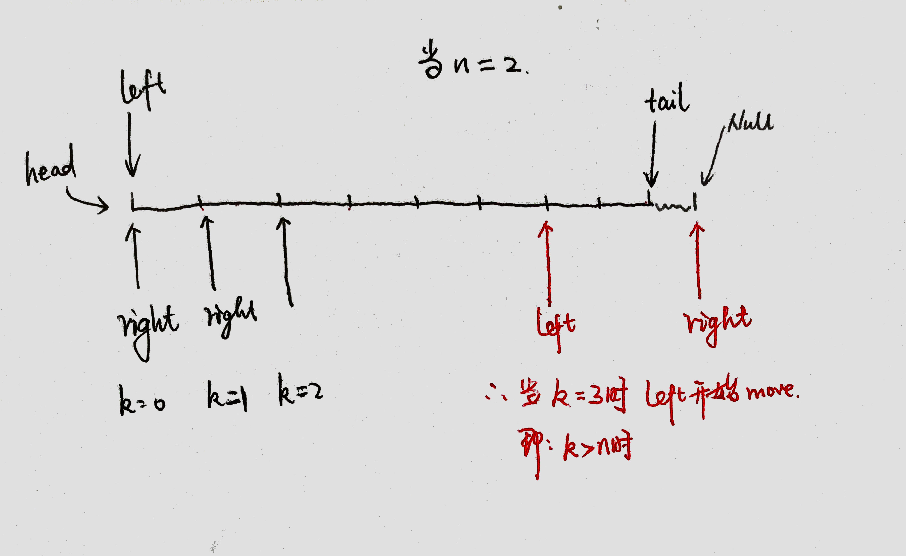
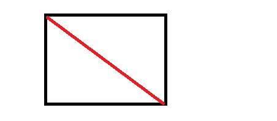

本文档用来记录 **leetcode** 前200题目中的easy与medium题目的思路。

- [1.两数之和](#1两数之和)
- [2  两数相加](#2--两数相加)
- [3. 无重复字符的最长子串](#3-无重复字符的最长子串)
- [5. 最长回文子串](#5-最长回文子串)
- [7. 整数反转](#7-整数反转)
- [9. 回文数](#9-回文数)
- [11. 盛最多水的容器](#11-盛最多水的容器)
- [13. 罗马数字转整数](#13-罗马数字转整数)
- [14. 最长公共前缀](#14-最长公共前缀)
- [15. 三数之和](#15-三数之和)
- [17. 电话号码的字母组合](#17-电话号码的字母组合)
- [19. 删除链表的倒数第 N 个结点](#19-删除链表的倒数第-n-个结点)
- [20. 有效的括号](#20-有效的括号)
- [21. 合并两个有序链表](#21-合并两个有序链表)
- [22. 括号生成](#22-括号生成)
- [26. 删除有序数组中的重复项](#26-删除有序数组中的重复项)
- [27. 移除元素](#27-移除元素)
- [28. 实现 strStr()](#28-实现-strstr)
- [33. 搜索旋转排序数组](#33-搜索旋转排序数组)
- [34.在排序数组中查找元素的第一个和最后一个位置](#34在排序数组中查找元素的第一个和最后一个位置)
- [35. 搜索插入位置](#35-搜索插入位置)
- [36. 有效的数独](#36-有效的数独)
- [38. 外观数列](#38-外观数列)
- [43 字符串相乘](#43-字符串相乘)
- [45 跳跃游戏 II](#45-跳跃游戏-ii)
- [46. 全排列](#46-全排列)
- [48.旋转图像](#48旋转图像)
- [49. 字母异位词分组](#49-字母异位词分组)
- [50. Pow(x, n)](#50-powx-n)
- [53. 最大子序和](#53-最大子序和)
- [54. 螺旋矩阵](#54-螺旋矩阵)
- [55. 跳跃游戏](#55-跳跃游戏)
- [56. 合并区间](#56-合并区间)
- [58. 最后一个单词的长度](#58-最后一个单词的长度)
- [61 旋转链表](#61-旋转链表)
- [62. 不同路径](#62-不同路径)
- [64. 最小路径和](#64-最小路径和)
- [66. 加一](#66-加一)
- [67. 二进制求和](#67-二进制求和)
- [69. x 的平方根](#69-x-的平方根)
- [70. 爬楼梯](#70-爬楼梯)
- [73. 矩阵置零](#73-矩阵置零)
- [75.  颜色分类](#75--颜色分类)
- [78. 子集](#78-子集)
- [79. 单词搜索](#79-单词搜索)
- [82 删除排序链表中的重复元素 II](#82-删除排序链表中的重复元素-ii)
- [83. 删除排序链表中的重复元素](#83-删除排序链表中的重复元素)
- [88. 合并两个有序数组](#88-合并两个有序数组)
- [91. 解码方法](#91-解码方法)
- [92  反转链表 II](#92--反转链表-ii)
- [93 复原 IP 地址](#93-复原-ip-地址)
- [96. 不同的二叉搜索树](#96-不同的二叉搜索树)
- [98. 验证二叉搜索树](#98-验证二叉搜索树)
- [100. 相同的树](#100-相同的树)
--------------------------------


### 1.两数之和

如果有序可以使用对撞双指针。复杂度位O(n)+O(n^2);

如果无序，使用哈希表。

一种办法是先全部插入哈希表，然后再搜索。复杂度位O(n)+O(1);注意的是数组中字符重复，hash的value需要使用vector；

二种办法是每次插入前查找哈希种是否存在 target-x。这样避免了上述的哈希值为vector。

### 2  两数相加

创建新链表dummy。逐位相加，新节点的和为 sum%10, 进位为sum/10。

循环判断条件为两个链表都为空。

如果最后的进位仍然大于0，创建新节点。

### 3. 无重复字符的最长子串

滑动窗口。

从字符串开头往一个unordered_set中放入。

从该字符随后的字符开始依次放入，当放入到发现重复字符时候，删除首字符。

第一层循环记录的为left边界。

第二层循环记录的是right边界。所以每次第二层循环退出时候。先进行统计，然后删除left元素。

trick：left边界与right边界均从0开始。

### 5. 最长回文子串

动态规划。

设 dp [ left ] [right] 表示 s[left,right] 是否为回文串。

因为：单个字母是回文。所以 dp [i] [i]=true;

loop: 字符串长度：2--Len。

loop：left：0--len：

​	求得right。

​    有以下情形：

​	right不合法，

​    right合法：

​		left字符与right字符不相等。false。

​       left字符与right字符相等。

​				长度为2,  true.

​				长度大于2. 

```c
dp[left][right]=(dp[left+1][right-1])&(dp[left]==dp[right])
```


每次循环结束做一些统计。

trick： 递推长度计算right。

### 6 Z 字形变换

根据行数建立数组。给每个数组填充字符。

填充规则：

loop 题目字符串。

ss[j]=i;

当遇到斜线的时候：

ss[j]=i


### 7. 整数反转

每次求出最后一位，然后再加入新的值。

注意：每次加入之前判断是否溢出。要求新的值 属于(INT_MIN,  INT_MAX);

### 8  字符串转换整数 (atoi)

```
void trim(string &s) 
{
    if (s.empty()) 
    {
        return ;
    }
    s.erase(0,s.find_first_not_of(" "));
    s.erase(s.find_last_not_of(" ") + 1);
}
```


### 9. 回文数

构造出整数的右半部分。

构造办法同整数反转，当 x<=right时候停止构造。

判断right与x是否相等或者差一个倍数。

trick：右半部分。

### 11. 盛最多水的容器

对撞指针，

loop：

移动数值小的一边，导致面积增大；

当左右重合时候面积为0.退出loop。

统计面积即可。


### 12 整数转罗马数字

```
q=[1000,900,500,400,100,90,50,40,10,9,5,4,1]
a=['M','CM','D','CD','C','XC','L','XL','X','IX','V','IV','I']
```

遍历直到该数值为0

### 13. 罗马数字转整数

从后往前遍历。如果pre小于cur，则合并为一组。游标多移动一次。

否则加当前字符。

退出时候看看游标是否指向0位置元素。

trick：记录游标的最后位置。

### 14. 最长公共前缀

贪心。

循环：1--len

求出当前字符串与当前prefix的交集。从而得到公共字符串。

### 15. 三数之和

先排序。

loop： first

loop： second

loop：判断third是否过大。否则左移动。


trick： 判断数值是否重复。

第三层循环时候注意second不能与third重合。


复杂度为：
$$
O(N^{2}).
$$
因为：双指针情况下，左右指针总共移动N次，因此为`O(N)`. 排序的复杂度为`O(NlogN)`. 所以和为平方。

```c
loop:
	loop:
		//从后往前找一个值，直到三数之和<=0.
```

### 16 最接近的三数之和

在第二层循环下进行对撞指针。

```
loop i
	j=i+1
	loop j k
		对撞 j k
```


### 17. 电话号码的字母组合

动态规划

```c++
设f(n) 为包含n个数字的号码的全部子集。
f(n+1)=对于f(n)的所有元素加入当前字符串的每个字符;
最后返回指定长度的字符串。
```

当n=0：  空字符串

n=1： 空，a，b，c

n=2：空，a,b,c,      d,e,f,   ad,ae,af,  bd,be,bf,   cd,ce,cf.

trick： 空集：{}

loop： 电话号码。

loop：f(n-1)的元素。（loop之前获得f(n-1)元素个数。 ）

loop:   当前电话号码的字符。

评：  这道题与其他的dp区别在于，f(n)与f(n-1)是在同一个数组中，也就是说：f(n)=ans[0..size];   f(n-1)=ans[0,f_little_size]. 且每个电话号码包含了三个字符，增加了一层循环。

### 18 四数之和

三层循环，最后一层循环进行对撞指针。

注意去重`if(j>i+1 && nums[j]==nums[j-1]) continue;`

对撞指针后，如果相等，则两边都移动。否则移动单向。 注意去重。

### 19. 删除链表的倒数第 N 个结点

前后指针



易错点：

当链表只有一个节点，也就是：k=1  and  n=1时候。

当k>1 且 k=n时候。 也就是删除头节点。

### 20. 有效的括号

用栈来解决。

如果是左括号，push

如果是右括号，检查括号是否可以与栈顶元素相匹配。如果匹配则弹出，否则就是无效括号。

trick：

栈顶元素：`stack.top()`

如果插入右括号时候，栈已经空。则无效。

### 21. 合并两个有序链表

创建一个头节点`dummy`。

**如果要求不能复制节点**，

移动指向dummy的一个指针，找到最大的值，两个链表的节点向后挪动。

最后判断是否两个链表结束。添加未结束的链表节点。

**如果能复制节点**

找到最大的值，然后创建以当前节点值的新节点。

trick：创建头节点。

### 22. 括号生成

回溯法：

```c
base 条件
    总的括号个数=2n

其他的可能选项：
左括号个数<n;放入左括号。
右括号个数<left时候;放入右括号。
```

这道题的思路：

往每个位置放置括号。有两种选择，左括号或者右括号。

左括号先放入，且最多只能放置n个。

放入右括号前必须有左括号，所以在 right<left时候可以放入右括号。

```c
n=2时候：
str.push_back (
backtrace left=0:right=0 :str=(
str.push_back (
backtrace left=1:right=0 :str=((
str.push_back )
backtrace left=2:right=0 :str=(()
str.push_back )
backtrace left=2:right=1 :str=(())
----------------------------------ans push back(())
str.pop_back )
str.pop_back )
str.pop_back (
str.push_back )
backtrace left=1:right=0 :str=()
str.push_back (
backtrace left=1:right=1 :str=()(
str.push_back )
backtrace left=2:right=1 :str=()()
-----------------------------------ans push back()()
str.pop_back )
str.pop_back (
str.pop_back )
str.pop_back (
```


### 24 两两交换链表中的节点


`while(prev && prev has next  && prev has next and next)`


### 26. 删除有序数组中的重复项

前后双指针：left指向当前待填充元素，right指向当前移动的元素。

第一次移动left ，直到left！=left++；

loop right is valid：

如果left！=right 则left++，left=right，right++；

改进做法：

只要判断left！=right 则left++，left=right。无需刚开始移动left到重复位置。

trick： size>=2时候才能进行loop。最后返回时候注意 cur+1；

### 27. 移除元素

前后双指针：left指向待填充元素，right指向当前移动的元素

首先移动left到val的地方。

随后如果`(right!=val)`，left=right，left++；

trick：注意left++ 的顺序。

### 28. 实现 strStr()

先用首字符匹配，再匹配剩余的字符。

字符串匹配。可用KMP算法（待看）。

trick：当needle.size=0时候，返回true。

### 33. 搜索旋转排序数组

二分查找。根据`nums[mid]<nums[right]` 判断左有序还是右边有序。

loop： left<=right.

判断target属于(mid,right],  或者属于[left, mid)。 

注意：循环的终止条件。画图能有效找到target的位置。


### 34.在排序数组中查找元素的第一个和最后一个位置

left =找到第一个等于target的值。
也就是mid=target时候做。范围向左边靠，right=mid-1；

right=找到第一个大于target的值-1；
也就是mid=target时候做。范围向右边靠，left=mid+1；

注意：loop的循环终止条件 left<=right.

返回的是left。

### 35. 搜索插入位置

标准二分查找。

### 36. 有效的数独

哈希表：建立三组unordered_set。一次循环放入。

注意：去除 `.`;

### 38. 外观数列

递归.

求外观数列的函数get ；

```
s[i]!=s[i+1]
```

trick: 标准答案中忽略了 s[i+1] 的判断是否有值。

### 39 组合总和

回溯。找到所有的组合，如果组合符合条件则记录答案。

trick:

剪枝： 排序。loop时候，如果当前的值已经大于了target，则不必要循环，因为随后的值肯定大于target。

### 40 组合总和 II

回溯。找到所有组合，如果符合条件则进行记录。

注意不可使用重复数字，所以在循环时候判断，如果当前数字等于之前的字符，则不进行循环。

```
if(i>s && candidates[i]==candidates[i-1])
                continue;
```


### 43 字符串相乘

模仿乘法。

结果是ans[m+n+1]

从尾部开始遍历

每次 更新ans[i+j+1]与ans[i+j]，

注意：更新时候要将ans的原有元素相加。

画图可以看出原理。

最后还需要删除前导0.

trick：

找前导0.： 从头开始遍历，直到该元素不为0.  如果遍历到尾部，则该ans为0.否则从非0开始的字串为答案。


### 45 跳跃游戏 II

每次跳最远。

``` c
 for(int i=0;i<size;i++){
            right=max(nums[i]+i,right);
            
            if(i==left){
                step++;
                left=right;
                if(right>=size-1) break;
            }
            
}
```


### 46. 全排列

回溯。

思路：将全排列看作是往每个位置插入数组中的一个数字，这个数字还是不重复的。

为此：创建一个visited数组，记录数组中的元素是否已经放入。

创建一个储存的数组temp，记录当前存储的数字。

回溯的base条件：size（temp）=nums.size

### 47 全排列 II

在46的基础上用了set去重。

官方的答案用回溯，在loop中去重。

```
if (vis[i] || (i > 0 && nums[i] == nums[i - 1] && !vis[i - 1])) {
                continue;
 }

```


### 48.旋转图像

对角线翻转。+水平左右翻转

```c
对角线反转：关注下三角
水平反转：关注左半个矩阵即可。
```



对角线反转：

```
row=0：size
col=0：row
swap a[row][col] 与 a[col][row]
```

### 49. 字母异位词分组

哈希表

key->vector

trick: 

vector 排序 sort(begin, end);

map遍历：loop 即可

it->second 没有括号

### 50. Pow(x, n)

思路：尽量用2的幂次数列来逼近n。所以，先将n进行拆解构造逼近数列。a=n；当为奇数，数列记录奇数，否则记录偶数。

反向遍历逼近数列。执行如下算法：

n为奇数则乘x，否则ans*ans

### 53. 最大子序和

贪心

目标使得之前序列和+当前值变大。

如果之前序列和为正，则加入当前元素，否则序列和`:=`当前元素。

### 54. 螺旋矩阵

模拟方向。序列化访问。

```
direc=[right,down,left,up];
direc=[(0,1),(1,0),(0,-1),(-1,0)]
```


创建 visited数组

loop 0，m*n

访问新方向时候，构造新的方向，判断是否该换方向。

### 55. 跳跃游戏

思路：在允许的范围内，在每一步跳到最远,如果能到达目标就返回true。否则返回失败.

trick：当i<=max_len时候执行跳跃。

### 56. 合并区间

贪心：根据区间的第一个数字排序，遍历排序后的数组。进行贪心合并。

难点：从nums[1]开始遍历排序后的数组，用一个游标记录当前的区间。当添加后则游标++；

### 57 插入区间

先插入，再合并。

trick:

```
if(ans.empty()){
                ans.push_back(it);
            }
```


### 58. 最后一个单词的长度

两个空格之间的即可。

### 59螺旋矩阵 II 

模拟跑一遍。

注意：将第一个字符先放入。


### 61 旋转链表

先用前后指针找到分割点，分成两个链表，然后将两个链表连接起来。

trick：

k有可能大于链表长度，所以需要k%len(list);

前后指针（画图）

```
int i=1;
        while(tail && tail->next){
            tail=tail->next;
            if(i>=k){
                prev=prev->next;
                cur=cur->next;
            }
            i++;
}
```


### 62. 不同路径

动态规划

```
f[i][j]记作。从0，0 到i，j位置所用的不同路径数。
f[i][j]=f[i-1][j]+f[i][j-1]
```

要到达ij位置，首先到达其上面或者左面的位置。

到达第一行或者第一列的路径数为 

```
f[0][0]=1;
f[0][j]=f[0][j-1]
f[i][0]=f[i-1][0]
```

### 63 不同路径 II

dp

设`dp[i][j]` 为从开始到 i,j 处的路径数。当上方有障碍物时候，用左边。当左边有障碍物时候用 上面。否则用上面加左边。

### 64. 最小路径和

动态规划

```c++
dp[i][j] 记为从(0,0)处出发到(i,j)处路径最小和。
dp[i][j]=min(dp[i-1][j],dp[i][j-1])+num[i][j];

先给第一行，第一列赋值。随后从dp[1][1]开始到dp[i][j]赋值。
```

### 66. 加一

数组遍历：从个位加到最高位，注意在数组头插入。

```
trick:
vector <int>::iterator begin = digits.begin();
digits.insert(begin,add);
```

### 67. 二进制求和

反转字符串，

获取较大size

然后逐位相加。

反转结果即可

` reverse(c.begin(), c.end());`

### 69. x 的平方根

二分查找。

```
sqrt(x) =mid 既使得 mid^2=x
如果 mid=x/mid; 则为平方根
```

### 70. 爬楼梯

动态规划：

爬第n阶楼梯的方法有两种：

1. 爬到第n-1阶，再爬一阶。
2. 爬到第n-2阶。再爬两阶。

`f(n)=f(n-1)+f(n-2)`

### 73. 矩阵置零

第一种办法：

建立一个同等大小的矩阵。记录每行每列的置零情况。

第二种办法:

先检查0行，0列是否需要置零。

从1行，1列检查是否需要置零，如果需要则在边缘端记录。

从1行，1列进行检查，置零。

将0行，0列置零。

### 74  搜索二维矩阵

二分搜索。

trick：

row= mid/size；

col=mid%size;

### 75.  颜色分类

前后指针。

左指针指向0， 右边指针指向2.

使用i 从`[0,right]`进行遍历。如果发现不是1则与对应位置进行调换。

注意的是：与right值对换过来的值，有可能是1，也有可能是0. 因此需要重新验证。

所以，当与right调换后，`i--`

因为之后当i指向的值不是0，与2的时候，i才会++。所以，i左边的值对换过来时候，一定是1.而不是0. 所以只需要换一次。

### 77 组合

回溯。

先生成数组，再按照组合的方法。

### 78. 子集

动态规划

```c++
设f(n)为结尾为第n-1个元素的数组的子集。
f(n+1)：=对于f(n)的所有元素加入num[i];

```

trick：

```
vector<int> cur(ans[j]);  // 复制ans[j]
```

### 79. 单词搜索

回溯法：

```c++
void backstrace(solution){
    if(solution){
        get(solution)
        return;
    }
    for (next_solution in solutions_list){
        if (next_solution){
            place_variable;
            backtrace(next_solution);
            remove_variabel;
        }
    }
}
```

解法：

创建一个visited

创建一个全局的结果

分别对四个方向backtrace

回溯的base条件：

长度与给定字符一致。

剪枝：如果 当前字符与给定字符不一致，或者 位置无效，或者访问过，或者结果已经找到。

对剩余的四个方向进行backtrace。


在main函数中，寻找首字符为 word[0]的开始。

### 80 删除有序数组中的重复项 II


### 81 搜索旋转排序数组 II

二分search。

与之前题目的区别是有重复数字。

如果无法通过比较 mid与left的值确定有序，则需要两边继续缩小范围。

`if(nums[mid]==nums[left] && nums[mid]==nums[right]){left++;right--;}`

### 82 删除排序链表中的重复元素 II

删除prev到最后一个重复元素的结尾。

核心代码为

``` c
if(cur->next && cur->val==cur->next->val){
                while(cur->next && cur->val==cur->next->val){
                    cur=cur->next;
}
```


### 83. 删除排序链表中的重复元素

方法一：每一次遍历：只要next节点与当前节点相等，则删除next节点。

方法二：左右指针。

右边指针从左指针开始，到与左指针不同的值停止，删除中间这一段。

### 86 分隔链表

新构建两个链表。less 与more。然后合并这两个链表。

该办法有些取巧

###  88. 合并两个有序数组

双指针。逆向遍历各个数组。

`nums[tail]=max(p1,p2)`

如果结束的情况，`p2`还没有遍历结束，复制p2。

trick：当p1为空，p2不为空的时候。复制p2.

当p2为空的时候，不用处理。

### 91. 解码方法

动态规划

思路：每次添加一个字符都考虑该字符是否可以与前面字符结合。

```c++
f(n) 记为前n个字符s[0..n]可以组成的解码数.
如果最后一个字符只用了s[n],f(n)+=f(n-1);
如果最后一个字符与s[n-1]结成了对子，f[n]+=f[n-2];
该题需要定义好f(n).
```

### 92  反转链表 II

画图。

找到m-node，n-node。以及prev-node。

每次将prev的next给  n-node与n-node的next

终止条件为 m-node==n-node。


### 93 复原 IP 地址

回溯法：

base条件

当遍历字符串结束，且tempList种有四个元素。


递归条件：

每个ip有三个字符可以遍历。

如果：str-to-int 小于255

排除  00

排除  01

可以开始回溯


trick：

当遍历字符串结束：`begin==size()`,  不是`begin==size()-1`

### 95 不同的二叉搜索树 II

用当前节点做根节点，生成左树，右树。然后将左子树右子树用根节点串起来。

### 96. 不同的二叉搜索树

动态规划

设dp[n]表示 有n个节点的时候，有多少种二叉搜索树。

`dp[n]=dp[0,i)*dp[i+1,n)`

trick：n从2开始。


### 98. 验证二叉搜索树

递归，分治。

也是：dfs

思路：如果这颗树只有三个节点。那么只要`left<root<right`即可。所以如果违反了这个条件，就一定不是二叉搜索树。 当左子树右子树不是单个节点时候，递归判断左右子树是否为二叉搜索树。

```c
ist(TreeNode* root,long long low,long long high)
```

### 100. 相同的树

递归，分治。

也是：dfs

```c++
base条件：	
if(p==nullptr && q!=nullptr){
    return false;
}else if(p!=nullptr && q==nullptr){
    return false;
}else if(p==nullptr && q==nullptr){
    return true;
}
if (p->val!=q->val){
    return false;
}

```

base条件详解：

如果两者其中一个为空，或者二者值不等就是不相同，否则为相同。

trick： 当二者为空时候返回true。且注意顺序问题。

