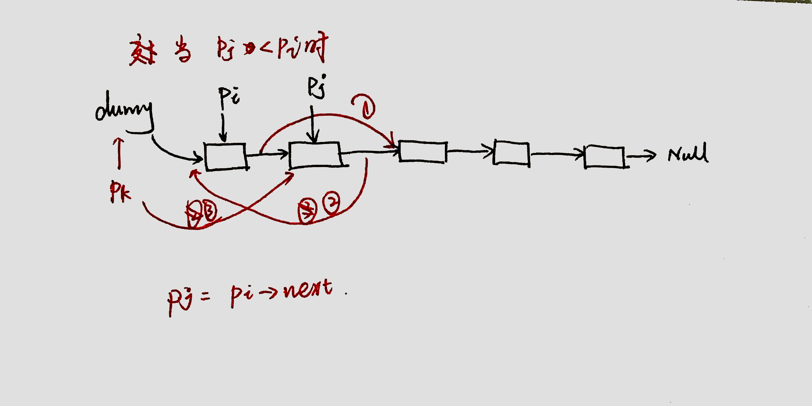

本文档用来记录 **leetcode** 前200题目中的easy与medium题目的思路。


- [101. 对称二叉树](#101-对称二叉树)
- [102. 二叉树的层序遍历](#102-二叉树的层序遍历)
- [103 二叉树的锯齿形层序遍历](#103-二叉树的锯齿形层序遍历)
- [104. 二叉树的最大深度](#104-二叉树的最大深度)
- [105. 从前序与中序遍历序列构造二叉树](#105-从前序与中序遍历序列构造二叉树)
- [110. 平衡二叉树](#110-平衡二叉树)
- [111. 二叉树的最小深度](#111-二叉树的最小深度)
- [112. 路径总和](#112-路径总和)
- [118. 杨辉三角](#118-杨辉三角)
- [119. 杨辉三角 II](#119-杨辉三角-ii)
- [120. 三角形最小路径和](#120-三角形最小路径和)
- [121 买卖股票的最佳时机](#121-买卖股票的最佳时机)
- [122. 买卖股票的最佳时机 II](#122-买卖股票的最佳时机-ii)
- [125. 验证回文串](#125-验证回文串)
- [128.  最长连续序列](#128--最长连续序列)
- [131. 分割回文串](#131-分割回文串)
- [134. 加油站](#134-加油站)
- [136. 只出现一次的数字](#136-只出现一次的数字)
- [138. 复制带随机指针的链表](#138-复制带随机指针的链表)
- [139. 单词拆分](#139-单词拆分)
- [142. 环形链表 II](#142-环形链表-ii)
- [143. 环形链表](#143-环形链表)
- [143. 重排链表](#143-重排链表)
- [146.LRU缓存机制](#146lru缓存机制)
- [147. 对链表进行插入排序](#147-对链表进行插入排序)
- [148. 排序链表](#148-排序链表)
- [152. 乘积最大子数组](#152-乘积最大子数组)
- [160. 相交链表](#160-相交链表)
- [162. 寻找峰值](#162-寻找峰值)
- [165. 比较版本号](#165-比较版本号)
- [167. 两数之和 II - 输入有序数组](#167-两数之和-ii---输入有序数组)
- [168. Excel表列名称](#168-excel表列名称)
- [169. 多数元素](#169-多数元素)
- [171. Excel表列序号](#171-excel表列序号)
- [172. 阶乘后的零](#172-阶乘后的零)
- [179. 最大数](#179-最大数)
- [189. 旋转数组](#189-旋转数组)
- [190. 颠倒二进制位](#190-颠倒二进制位)
- [191. 位1的个数](#191-位1的个数)
- [198. 打家劫舍](#198-打家劫舍)
- [199. 二叉树的右视图](#199-二叉树的右视图)
- [200. 岛屿数量](#200-岛屿数量)

--------------------------------


### 101. 对称二叉树

递归，分治。

也是：dfs

思路：比较左右子树，如果左右子树不相等，则为false。否则为true。

最后递归比较，root1->left与root2->right.    root1->right与root2->left. 

与100题类似。

### 102. 二叉树的层序遍历

bfs：

借助队列。先放进root，拿出后依次放入左、右子树。再拿出。

第一层循环停止条件：q is empty，

第二层循环，提前拿到size=q.size();

trick： size=q.size

### 103 二叉树的锯齿形层序遍历

bfs

记录深度，如果深度是偶数，则reverse这个list

trick：

bfs的pop_back的位置。

vector.front()

### 104. 二叉树的最大深度

递归。

也是： dfs

思路：dfs这个棵树。求得左右子树最大深度。

base条件

```C++
if(root==nullptr){
     return 0;
}
```

### 105. 从前序与中序遍历序列构造二叉树

分治。

思路：根据先序找到根节点。再根据根节点从中序找到左右子树得中序。

构建根节点。

构建左子树。（根据，左子树的先序，中序）。

构建右子树。

base条件：

两个序列为空。

trick：复制一段vector方法： vector<int> p1(pre.begin()+1,pre.begin()+1+j);

### 106 从中序与后序遍历序列构造二叉树

与105相同。构造根与其他的即可。

### 107 二叉树的层序遍历 II

正常的层序遍历。只是答案插入顺序相反。

`ans.insert(ans.begin(),tmp);`

### 108 将有序数组转换为二叉搜索树

二叉搜索树的中序为有序数组。因此找到数组中间位置为根。剩余的构建左子树右子树即可。

### 109 . 有序链表转换二叉搜索树

找到中间数字即为根。分割链表。构建左子树，构建右子树。

trick:

prev=slow

slow=slow->next;

### 110. 平衡二叉树

递归，分治。

dfs求深度

判断左右子树深度的abs是否超过1.

### 111. 二叉树的最小深度

递归，分治，dfs。

思路：求左子树右子树的最小深度。

base条件：

root为空

左右子树为空。

**trick**：对左子树右子树分别求深度，因为有可能二者其中之一为空树。

### 112. 路径总和

递归，分治。dfs

base条件：

root 空，false

root=target    且左右子树均为空  true 否则为 false；


递归：

左右子树是否满足=`target-root->val`

### 113 路径总和 II

回溯

trick：

当每次push进去后判断是否符合条件。

```
 if(targetSum-root->val==0 && root->left==nullptr && root->right==nullptr){
           ans.push_back(cur);
}
```

### 114 二叉树展开为链表

dfs

如果转换好的左子树为空，则root.right=r;

如果转换好的左子树不为空。root.right=l. l.last=r;

### 118. 杨辉三角

数组遍历：记录前面一行，

```
int sum=pre[j]+pre[j+1];
t[j+1]=sum;
```

trick：第一行，第二行直接构造。

第三行构造时候，从构造第二个到倒数第二个元素。

### 119. 杨辉三角 II

递归. 

```
fn=fn-1, 将fn-1的构造出来。
```

### 120. 三角形最小路径和

动态规划

思路：求从顶点到每层每个顶点的最小路径。最后将这一层的路径和求最小值。

```c++
dp[i][j] 记为从(0,0)到位置(i,j)的最小路径和。
//非边缘节点。
dp[i][j]=min(dp[i-1][j],dp[i-1][j-1])+num[i][j]

    
// 对角线节点 j=i时候dp[i-1][i]不存在
dp[i][i]=dp[i-1][i-1]+num[i][j]
// 左边缘节点j=0,dp[i-1][-1]不存在
dp[i][0]=dp[i-1][j]+num[i][j]
```

trick：对于边缘顶点的求取。由于届时`dp[i][i]=dp[i-1][i-1]+num[i][j]`;中的元素会变化，所以需要在循环终求取。

### 121 买卖股票的最佳时机

贪心。

从尝试所有的买卖组合。找到最大值即可。

双层循环，判断利润是否变大。

### 122. 买卖股票的最佳时机 II

当当前卖掉股票是正利润时候，则卖掉。

trick： 从第二天开始算利润。也就是从cur=1开始。

### 125. 验证回文串

对撞指针。

如果遍历完成就是true。否则是false。

trick：过滤用`isalnum` ；`tolower`

### 128.  最长连续序列

暴力解法为

遍历数组中的每个元素，对于每个元素寻找 `x+1`;直到寻找到最值。这样的复杂度为平方级。


假设最终的答案为`X1,X2,...Xm`; 那么如果我们能找到`X1`,并且从该位置寻找，就能找到最终的`Xm`;

而`X1`的特征就是 ，不存在 `x=X1-1`;所以，该题的解法为，先将数据存在set中，再找到一个值`x`, `x-1`不存在，从x做循环找到最值。

### 129 求根节点到叶节点数字之和

先用回溯将所有从根到叶子节点的数字取到，再将数字相加。

trick:

每次push进去后判断是否符合条件：

```
if(root->left==nullptr && root->right==nullptr){
            ans.push_back(cur);
        }
```

### 130 被围绕的区域

从边进行dfs。将o改成G，随后再遍历矩阵，将G该成o，将o改成x

### 131. 分割回文串

回溯。

此题没有思路。记下来吧。

```
backtrace(,pos){
//base 
pos==size;
add ans;
}

//resursive 
for(i=pos,i<size){
if substr(pos,i) is pal  add substr,
backtrace();
remove substr.
}
```


### 134. 加油站

思路：从头开始跑。如果跑不到起点，则从失败的下一个位置跑。

起点start的范围是`[0...size)`

模拟跑的时候，从start开始跑，cur为当前的节点，范围是`[start, start+size)`

当gas为负值的时候跳出loop。或者当回到起点时候跳出loop，也就是cur==start+size

失败的下一个位置为`cur+1`

trick:当跳出时候，gas的计算值为0.

### 136. 只出现一次的数字

异或运算具有结合律，交换律。

```
a^a=0
0^b=b
```

### 138. 复制带随机指针的链表

建立映射

```c
mp[it]->random=mp[it->random];
```

### 139. 单词拆分

动态规划

```

设dp[i] 记为s[0...i) 字符串是否可以被分割成功。  
dp[0]表示空字符串。
dp[i]=dp[j]  && check(substr[j...i) );  
所以最后返回的应该为 s[n]
```

trick:  dp的长度应该为n+1


### 142. 环形链表 II

思路：通过快慢指针找到相遇点，然后另一个指针从起点开始。与从相遇点开始的指针以相同的速度移动。直到相遇

trick:

快慢指针：

```c++
if(fast->next==NULL || fast->next->next==NULL){
                return NULL;
}
```

如果用先移动，再移动一次会出错。

### 143. 环形链表

快慢指针。

如果最终的快慢指针重合，则为成功。否则为失败。

trick：

移动快慢指针用

```c
while(fast && fast->next){
            slow=slow->next;
            fast=fast->next->next;
}
```


### 143. 重排链表

快慢指针找到中点。

分割成两个链表。

反转l2链表。

遍历二者组成相间的节点。

trick：


### 146.LRU缓存机制

cache的存储为 list<pair<int,int>>

索引为： map<int, list<pair<int,int>::iterator >

思路为每次get或者put都要把对应的节点放到前方 `list.splice(list.begin(),list,node_iterator)`

cache的初始化空间为 capacity

### 147. 对链表进行插入排序

插入排序



```c++
node* new_dum;
new_dum->next=head;

node* pi=head;
node* pj=head->next;
while(pj){
    if(pj->val>=pi->val){
        pi=pi->next;
    }else{
        node* pk=dumy;
        while(pk->next->val <= pj->val){
            pk=pk->next;
        }
        
        node* t=pj;
        pi->next=pj->next;
        pj=pj->next;
        t->next=pk->next;
        pk->next=t;
    }
    pj=pi->next;
}
```

### 148. 排序链表

归并排序

分治
fast!=tail
而不是 fast!=nullptr
```c++
//先将两半排序，再将两半合并。

void merge(h1,h2){
    // 合并两个有序链表
}

node* merge_sort(start, end){
    mid;// 用快慢指针找到中点。
    h1=merge_sort(start, mid);
    h2=merge_sort(mid,end);
    merge(h1,h2);
}
```

### 151 翻转字符串里的单词

python中用了split 以及strip。 逆序拼接即可

### 152. 乘积最大子数组

动态规划

思路：先获取小的数组的最大乘积。然后添加数字之后再求最小乘积。

有个问题是：

当当前数字为正的时候，我们希望f(n-1)为正。

当当前数字为负的时候，我们希望f(n-1)为负。

因此维护一个fmin数组。


```c
dp[n] 记作以第n个数字结尾的数组的最大连续子数组的和;

fmax[n]=max(num[n],fmax[n-1]*num[n],fmin[n-1]*num[n]);
fmin[n]=min(num[n],fmax[n-1]*num[n],fmin[n-1]*num[n]);
```

### 153  寻找旋转排序数组中的最小值

二分。

左有序时候取左子中的最小值。left右边移动。否则取得右子数组中最小值。right左移。

trick: `while left<=right`

### 155 最小栈

找一个辅助的栈。每次push当前最小值。

### 160. 相交链表

先各自遍历,到尾部后,交换遍历.

终止条件为a==b

返回a即可。


### 162. 寻找峰值

二分查找，`mid 与 mid+1`相比。
画出折线图，然后尽量往最值靠近。


### 165. 比较版本号

遍历两个字符串。

获得两个版本号。

​			`while(a>='0'  && a<='9')    v+=int(a)`

比较。

如果比较完成还是正确，则返回0

### 167. 两数之和 II - 输入有序数组

二分查找。

判断`sum=numbers[left]+numbers[right];`与`target` .

### 168. Excel表列名称


假设
$$
x=a_{0}*26^{0}\quad+ a_{1}*26^{1}\quad+... \quad+ a_{n}*26^{n};
$$
对`x%26` 即可得到 
$$
a_{0}
$$
再对`x/26`即可得到
$$
x=a_{1}*26^{0}\quad+... \quad+ a_{n}*26^{n-1};
$$
 但是由于
$$
26=26*26^{0}
$$
所以导致`x/26=1`,那么有
$$
x=1+a_{1}*26^{0}\quad+... \quad+ a_{n}*26^{n-1};
$$
所以此时要`x-1`

### 169. 多数元素

哈希表。

```c++
counts.insert(make_pair(nums[i],1));
```

### 171. Excel表列序号

26进制。逆序访问

### 172. 阶乘后的零

求2与5的个数最小值。

trick：count函数可以`while(a&& a%5==0)`

### 179. 最大数

先排序，再拼接。

排序规则：二者组合，取大者。


trick:

计算顺序时候，使用  long long x；

```
 如果ans[0]==0  
return 0
```

### 189. 旋转数组

第一种方法：创建一个同样大小的数组，从第k个元素开始赋值。

第二种方法：先整体反转，再反转前半截，反转后半截。

第三种方法：对于每个元素，算出其应当在的位置，与那个元素交换。由于可能会发生回到起点但是元素还未遍历完的现象。所以需要外层的loop(gcd(n,k))。trick：用do while，   gcd 表示最大公约数。

### 190. 颠倒二进制位

左移动为`i+=(k<<(31-j));`位。

### 191. 位1的个数

位运算。右移动即可。

### 198. 打家劫舍

动态规划

```
设dp[i]  记为偷第i+1个房间时候获得的最大值。
dp[i]=max(dp[i-1],dp[i-2]+num[i]);
```

trick：

从i=2开始进行计算。也就是说 dp[0],dp[1]需要预先赋值。

需要排除 0， 1 个房间这种特殊值。

### 199. 二叉树的右视图

bfs

每次先放入右子树，且当取得第一个节点时候，放入ans中。

### 200. 岛屿数量

dfs

dfs的可行条件的：

位置无效，位置为0. 位置已经访问过。

用dfs遍历整个二维数组。如果dfs可以走完则加一。

trick：位置访问不用新建一个数组，使用 `grid[i][j]=0`即可。


